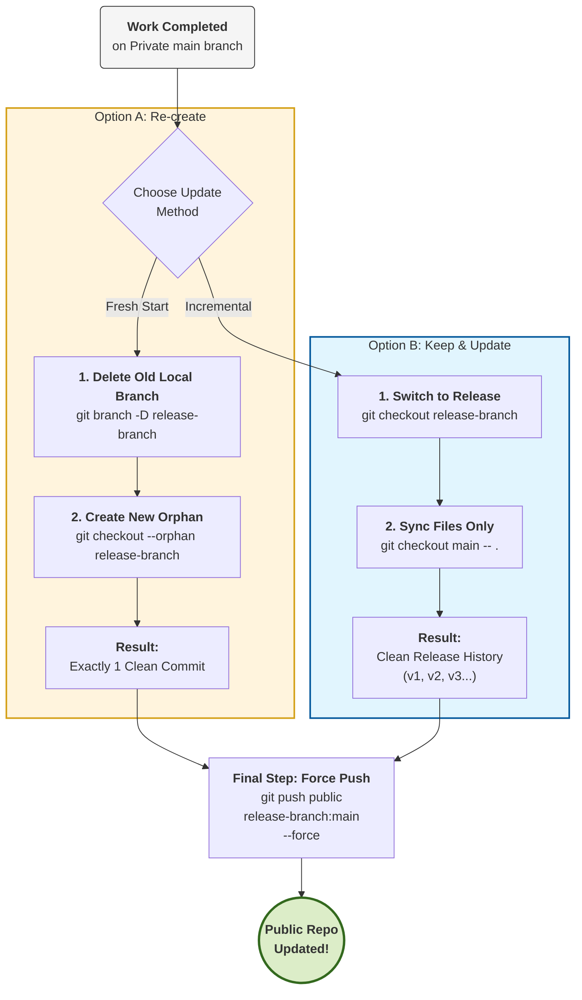

# my-private-repo version 2.0

This is a private repository for testing orphan branch.

## Create private repo for development


## Add public remote for release
```bash
git remote add public git@github.com:user_name/my-public-repo.git    
```

## Create orphan branch for release without history
```bash
git checkout --orphan release-branch
```

## List remote after adding public repo
```bash
~ git remote -v                                                  
origin  git@github.com:user_name/my-private-repo.git (fetch)
origin  git@github.com:user_name/my-private-repo.git (push)
public  git@github.com:user_name/my-public-repo.git (fetch)
public  git@github.com:user_name/my-public-repo.git (push)
```

## Release Process

To push the release code to the public remote using an orphan branch without private repo's commit history, follow these steps:

## Option 1. Update Public Repo (keeping public repo's commit history)

To update the public repository with the latest changes from the private repository, maintaining the separate history:

1. **Switch to release branch**:
   ```bash
   git checkout release-branch
   ```

2. **Sync content from main**:
   Bring in the latest files from the main branch without merging the commit history.
   ```bash
   git checkout main -- .
   git add .
   git commit -m "Update public release"
   ```

3. **Push updates**:
   ```bash
   git push public release-branch:main
   ```

## Option 2. Reset Public Repo (reset public repo's commit history)

1. **Delete release-branch**:
   ```bash
   git branch -D release-branch
   ```

2. **Create release-branch with --orphan**:
   ```bash
   git checkout --orphan release-branch
   ```

3. **Add files and commit**:
   ```bash
   git add .
   git commit -m "Clean history release v1.2"
   ```

4. **Push updates**:
   ```bash
   git push public release-branch:main --force
   ```

## Diagram
